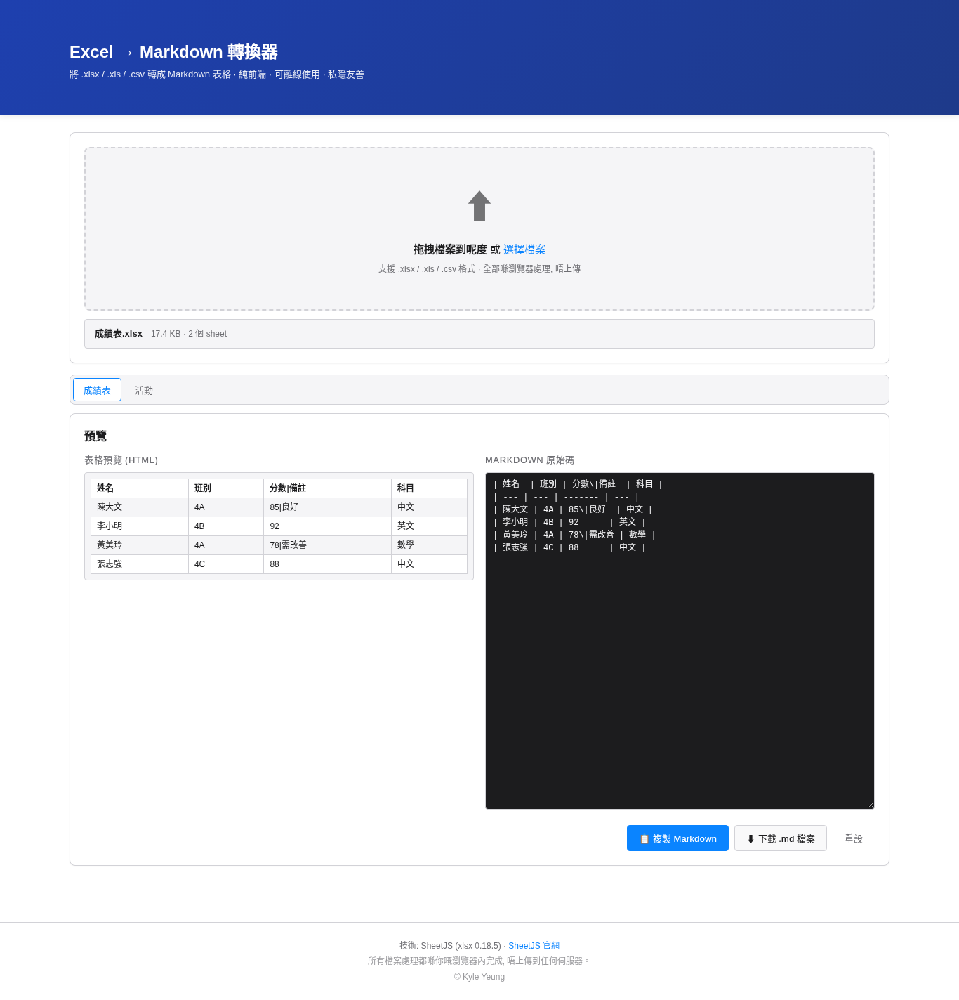
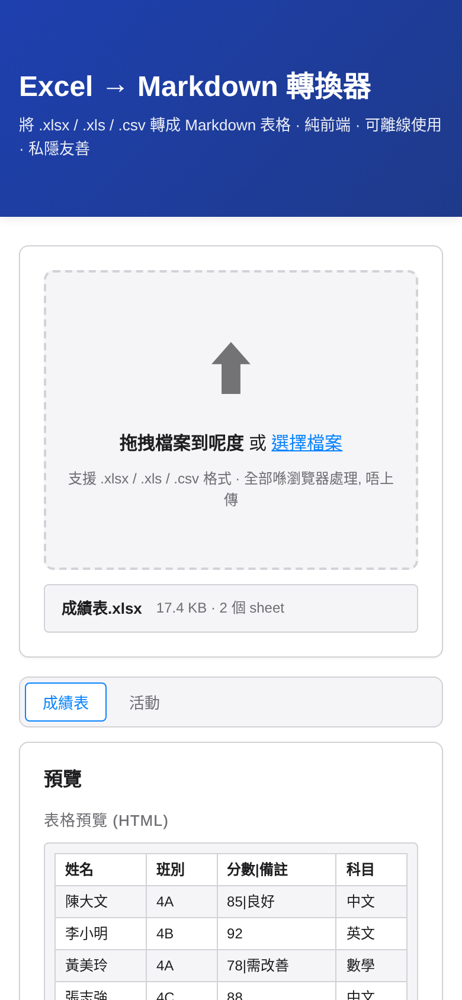

# excel2md

香港教師日常面對大量 Excel 成績表、學生名單、活動報名表。本工具將 `.xlsx` / `.xls` / `.csv` 喺瀏覽器內即時轉成 Markdown,直接貼到學校通告、文件、內部 wiki。

**無需安裝、檔案不上傳、零追蹤** — 全部檔案喺你部電腦嘅瀏覽器內處理(用內置嘅 [SheetJS](https://github.com/SheetJS/sheetjs) 解析),適合處理含學生個資、評估成績等敏感內容的試算表。

**🔗 Live Demo:<https://kyleyct.github.io/excel2md/>**



| 上載畫面 | 手機版 |
|---|---|
|  |  |

## 功能

- **拖拽即轉**: 拖 `.xlsx` / `.xls` / `.csv` 檔入上傳區,即時預覽 Markdown
- **多 sheet 切換**: 工作簿內多個分頁逐個轉換,頂部 tab 切換
- **表頭**: 以工作表第 1 行做表頭,其餘非空白行做資料行
- **安全跳脫**: 儲存格內嘅 `|` 喺 Markdown 輸出自動跳脫為 `\|`,換行轉為空格,表格唔會斷裂
- **兩種取用方式**: 複製到剪貼簿、下載 `.md` 檔案(目前分頁)
- **預覽分屏**: 左邊 HTML 表格預覽、右邊 Markdown 原始碼
- **離線可用**: 全部 script 喺前端,毋須後端伺服器

## 快速開始

### 本地 Demo (推薦)

```bash
# 1. 下載或 clone 本 repo
git clone https://github.com/kyleyct/excel2md.git
cd excel2md

# 2. 啟動本地 server
./start-demo.sh        # macOS / Linux
# 或
start-demo.bat         # Windows

# 3. 開瀏覽器
# http://localhost:8080/

# 4. 拖個 .xlsx 檔入上傳區
```

### GitHub Pages (公開 demo)

開 https://kyleyct.github.io/excel2md/ 直接用,毋須安裝。

**注意**: GitHub Pages 版會將檔案透過你部機嘅瀏覽器處理,實際運算喺 client side,無 server-side 上傳,符合私隱要求。詳見 [私隱與安全](#私隱與安全)。

## 私隱與安全

- 全部檔案喺你部機嘅瀏覽器內解析,**從不上傳到任何伺服器**
- 開發者無任何分析、追蹤、cookie、第三方 CDN
- 連線內容只限開啟網頁本身;拖拽嘅 Excel 內容從不出網
- 適合處理含學生個資、評估成績、特殊學習需要紀錄的試算表
- 原始碼完全公開,你可以 audit 任何一行 JavaScript

技術上依賴 [SheetJS CE 0.18.5](https://github.com/SheetJS/sheetjs) (Apache 2.0),已 vendor 入 `assets/vendor/xlsx.full.min.js`,毋須連外網。

## 安裝細節

見 [`docs/install.md`](docs/install.md)。

## 開發筆記

### 設計決策

- **必要 + CSV 支援**: 用戶實際檔案有 .xls(舊版)、.xlsx(新版)、.csv(匯出)三種
- **單頁式 layout**: drag-drop 即轉即預覽,毋須多頁導航
- **SheetJS vendor 入 repo**: 毋須連外部 CDN,離線可用,版本鎖定
- **雙 deploy**: 本地 demo(私隱) + GitHub Pages(公開)
- **parser.js module 化**: 7 個純 function 唔耦合 DOM,方便測試同重用
- **跳脫只喺輸出做**: parser 保留原始文字畀 HTML 預覽,`rowsToMarkdown` 先至做 Markdown 跳脫

### 技術棧

- HTML5 + 原生 JavaScript (ES2020)
- CSS3 (Grid + Flexbox + 動畫)
- [SheetJS CE 0.18.5](https://github.com/SheetJS/sheetjs) (Apache 2.0, vendored)
- 0 後端、0 資料庫、0 build step

### 檔案結構

```
excel2md/
├── index.html              # 單頁式 UI
├── assets/
│   ├── style.css           # 樣式
│   └── vendor/
│       └── xlsx.full.min.js  # SheetJS 0.18.5 (880KB, Apache 2.0)
├── scripts/
│   ├── parser.js           # 7 個純 function API
│   └── app.js              # UI controller (drag-drop, tabs, etc.)
├── docs/
│   ├── install.md          # 安裝細節
│   └── screenshot-*.png    # README 截圖
├── start-demo.sh           # macOS / Linux 一鍵啟動
├── start-demo.bat          # Windows 一鍵啟動
├── README.md               # 本檔案
├── LICENSE                 # MIT
└── .gitignore              # Git 忽略
```

### 7 個 Parser API

```js
// 從 ArrayBuffer / Uint8Array 解析 workbook
Excel2Md.parseWorkbook(data) → {workbook, sheets: [{name, json, worksheet}]}

// 整本 workbook 轉成單一 markdown(每個 sheet 一節)
Excel2Md.workbookToMarkdown(parsed, opts) → string

// 單個 sheet(或二維 array)轉成表頭 + 資料行(原始文字,未跳脫)
Excel2Md.sheetToJson(sheetOrRows, opts) → {headers, rows, headerRow, totalRows}

// 表頭 + 資料行轉 markdown table(喺呢度做跳脫)
Excel2Md.rowsToMarkdown(headers, rows, opts) → string

// 自動偵測哪一行係表頭
Excel2Md.detectHeaderRow(rows) → number

// 儲存格內容 escape(`|` → `\|`,換行 → 空格)
Excel2Md.escapeCell(value) → string

// 表頭 escape(同上,另加 trim)
Excel2Md.escapeHeader(name) → string
```

所有 API 為純 function,毋須 DOM;喺 Node.js 使用時需先將 SheetJS 設為 global `XLSX`。

## 貢獻

歡迎 fork + PR!請遵守:
- 唔加外部 CDN 依賴(第三方庫 vendor 入 repo)
- 保持私隱取向(無追蹤、無 CDN、無 analytics)
- 保持香港繁體書面語(對外文件)
- 保持 mobile-responsive

## 授權

[MIT](LICENSE)

## 作者

© [Kyle Yeung](https://github.com/kyleyct)
